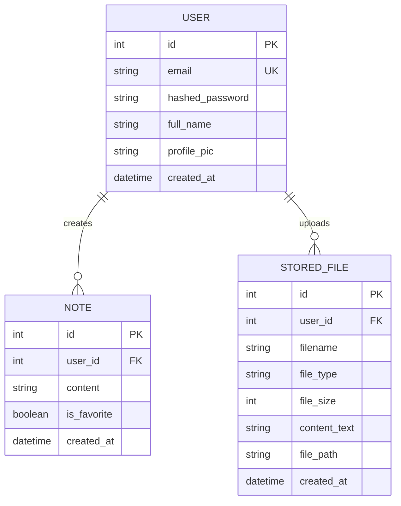
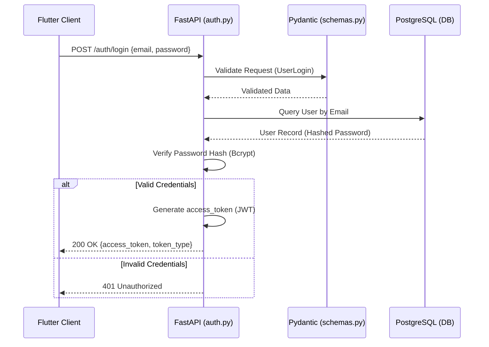
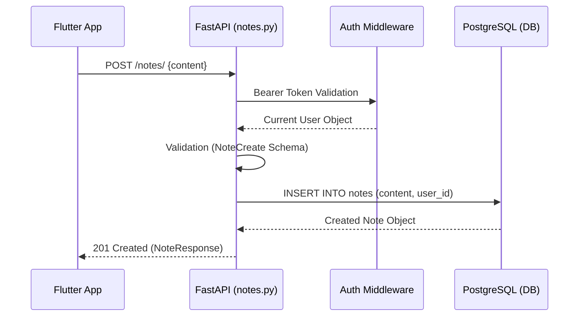
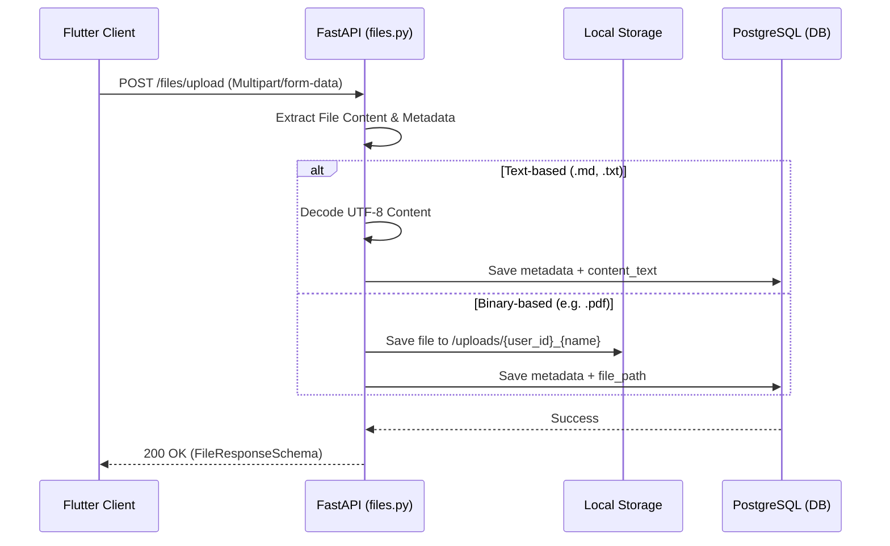

# Brain Dump Backend Documentation

## 1. System Overview
The Brain Dump backend is a high-performance API built with **FastAPI**, designed to handle user authentication, note management, and file storage for "The Vault".

### Technical Stack
- **Framework**: FastAPI (Python 3.13+)
- **Database**: PostgreSQL
- **ORM**: SQLAlchemy
- **Authentication**: JWT (JSON Web Tokens) with OAuth2 Password Bearer flow
- **Validation**: Pydantic v2
- **File Storage**: Local Disk Storage (for binary files) & Database (for metadata and text content)

### Folder Structure
```text
backend/
├── main.py          # Application entry point & router registration
├── database.py      # SQLAlchemy engine and session configuration
├── models.py        # SQLAlchemy database models
├── schemas.py       # Pydantic schemas for request/response validation
├── auth.py          # Authentication logic, JWT issuance, and signup/login
├── files.py         # File upload, retrieval, and "The Vault" logic
└── notes.py         # "Quick Save" notes CRUD operations
```

---

## 2. Database Schema (ERD)
The database uses a relational schema with a one-to-many relationship from the User to their Notes and Files.



---

## 3. Critical Backend Flows

### Flow A: Authentication (Login)
Handles credential verification and JWT generation.



### Flow B: The "Quick Save" (Text Note)
Persists user thoughts directly to the database.



### Flow C: File Upload (The Vault)
Handles multi-modal storage for markdown, text, and binary files.



---

## 4. API Reference

| Method | Endpoint | Description | Input Schema |
| :--- | :--- | :--- | :--- |
| `POST` | `/auth/signup` | Register a new user | `UserCreate` |
| `POST` | `/auth/login` | Authenticate and get JWT | `UserLogin` |
| `GET` | `/auth/me` | Get current user info | `None` (Bearer) |
| `POST` | `/notes/` | Create a new quick note | `NoteCreate` |
| `GET` | `/notes/` | List all user notes | `None` (Bearer) |
| `POST` | `/files/upload` | Upload file to Vault | `Multipart/Form` |
| `GET` | `/files/` | List all user files | `None` (Bearer) |
| `GET` | `/files/{id}` | Get file content or download | `None` (Bearer) |
