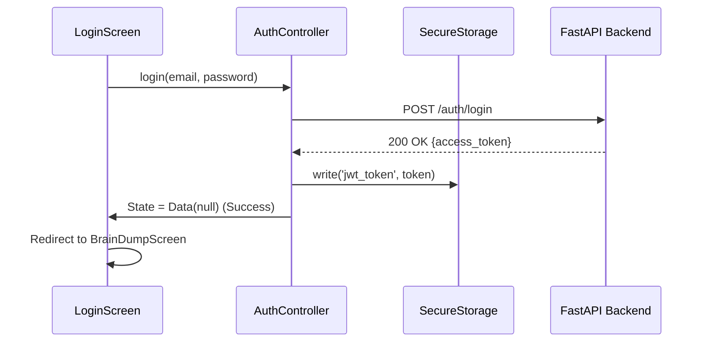
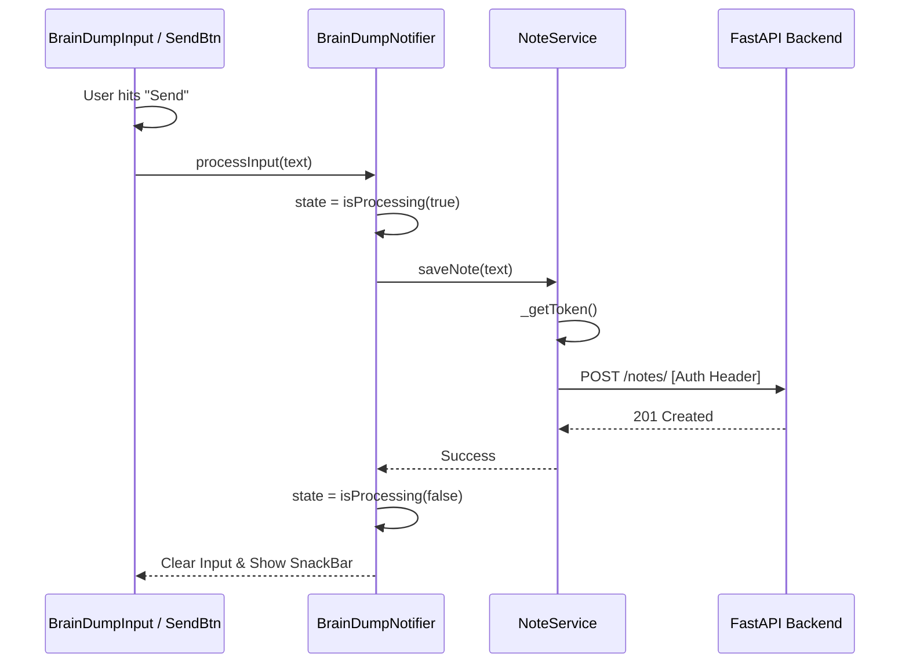
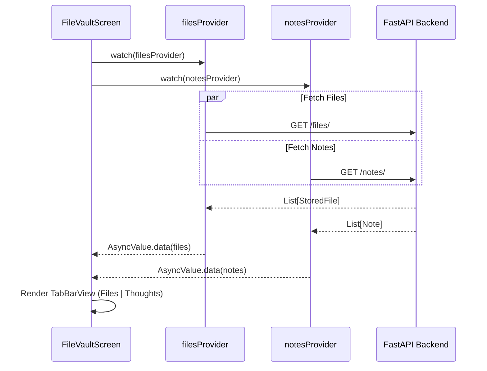
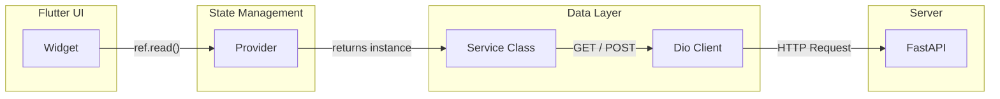

# Brain Dump Frontend Documentation

## 1. Architecture Overview
The frontend is built with **Flutter**, utilizing a feature-first folder structure and **Riverpod** for robust state management. It communicates with the FastAPI backend using **Dio** for networking.

### Tech Stack
- **Framework**: Flutter (Dart)
- **State Management**: Flutter Riverpod (Providers, StateNotifiers, AsyncValue)
- **Networking**: Dio (with Interceptors & Options)
- **Local Storage**: Flutter Secure Storage (for JWT persistence)
- **UI Components**: Custom "Glassmorphism" widgets, Animated Builders, and a macOS-style Dock.

### Folder Structure
```text
lib/
├── main.dart             # App entry & ProviderScope
├── core/
│   ├── providers/        # Global singletons (e.g., dio_provider)
│   └── widgets/          # Reusable UI (MinimalIconButton, SynapticRoots)
├── features/
│   ├── auth/             # Login/Signup logic & UI
│   ├── brain_dump/       # Main input screen & Neural Tree visualization
│   ├── dock/             # Mac-style Zooming Dock logic
│   ├── notes/            # NoteService & Quick Save logic
│   └── vault/            # FileService & The Vault UI
└── screens/              # Top-level screen composites (BrainDumpScreen)
```

---

## 2. Key Providers & Services

| Provider | Type | Responsibility |
| :--- | :--- | :--- |
| `authControllerProvider` | `StateNotifierProvider` | Handles Login/Signup, stores JWT, manages Auth state. |
| `noteServiceProvider` | `Provider` | API client for the `/notes` endpoints. |
| `brainDumpProvider` | `StateNotifierProvider` | UI logic for the input field, processing state, and neural animations. |
| `filesProvider` | `FutureProvider` | Fetches the list of files for The Vault. |
| `dockProvider` | `StateNotifierProvider` | Manages the open/close state and animation of the Dock. |
| `dioProvider` | `Provider` | Configured Dio instance (BaseUrl, Timeouts). |

---

## 3. Interaction Flows (Sequence Diagrams)

### Flow A: User Authentication & Session
How the app establishes a session and maintains it.



### Flow B: Quick Save (Saving a Thought)
The path a user's thought takes from input to the database.



### Flow C: Opening The Vault
Fetching data for the unified File/Note view.



---

## 4. State Management Strategy

The app uses **Riverpod** to separate UI from Logic.

1.  **UI Level**: Widgets like `BrainDumpScreen` watch providers. They react to changes (e.g., showing a spinner when `brainDumpProvider` is loading).
2.  **Logic Level**: `StateNotifier`s (like `BrainDumpNotifier`) hold the business logic. They mutate their state (e.g., `state = state.copyWith(isProcessing: true)`) which triggers UI rebuilds.
3.  **Data Level**: Services (like `NoteService`) are pure Dart classes that perform IO. They are injected into Notifiers via Ref.

### Data Flow Visualization
This layered approach ensures that the UI never directly touches the Network layer.


