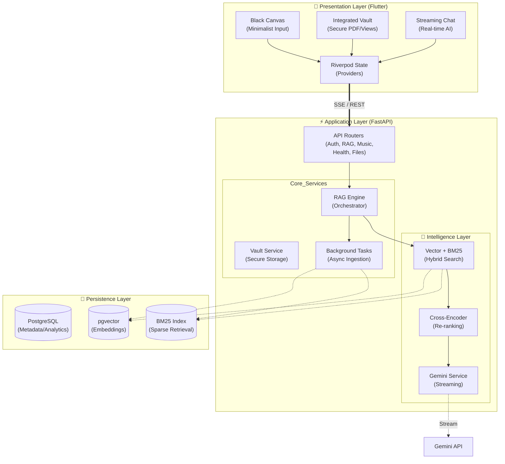

# BrainDump System Design

## 1. Abstract
"Brain Dump" is a minimalist, mobile-first context-aware cognitive assistant. It solves fragmented attention by providing a "Black Canvas" for rapid thought capture, integrated with a sophisticated RAG (Retrieval-Augmented Generation) pipeline that grounds responses in the user's own data (notes, files, and sensory context).

## 2. High-Level Architecture
The system utilizes a **Client-Server Architecture** with a Flutter frontend and a FastAPI backend.

## 3. Core Component Domains

### 3.1 Frontend Features (`lib/features/`)
- **brain_dump**: Core experience. Handles mode-locked entry (Journal vs. Chat) and SSE streaming output with typewriter effects for AI responses.
- **analytics**: Visualizes thought streaks, heatmap loops, and categorical themes using the backend analytics engine.
- **vault**: Secure management of RAG-indexed source materials with integrated document viewing.
- **health/music**: Native bridge controllers for HealthKit/MusicKit, syncing sensory context markers to the backend.

### 3.2 Backend Services (`app/services/`)
- **rag_engine.py**: The singleton orchestrator for hybrid search and text indexing.
- **vault_service.py**: Secure document management and path sanitization.
- **music_analyzer.py**: Translation of Apple Music data into VAD mood vectors.
- **gemini_service.py**: Interaction with Google's Generative AI for streaming.

## 4. Data Flow: The Ingestion Pipeline
1. **Trigger**: User saves a note or uploads a file.
2. **Preprocessing**: Text is cleaned and split using `RecursiveCharacterTextSplitter`.
3. **Indexing**: 
   - **Dense**: `SentenceTransformer` generates embeddings stored in `pgvector`.
   - **Sparse**: Text is tokenized and stored in a persistent `BM25` index.
4. **Metadata**: User ID and Sensory Markers (Location/Music/Health) are tagged to each chunk.

## 5. Deployment
- **Platform**: Ubuntu Server.
- **Web Server**: Uvicorn with Gunicorn worker management.
- **Reverse Proxy**: Nginx (optional, depending on environment).
- **Process Management**: Systemd for persistence.
