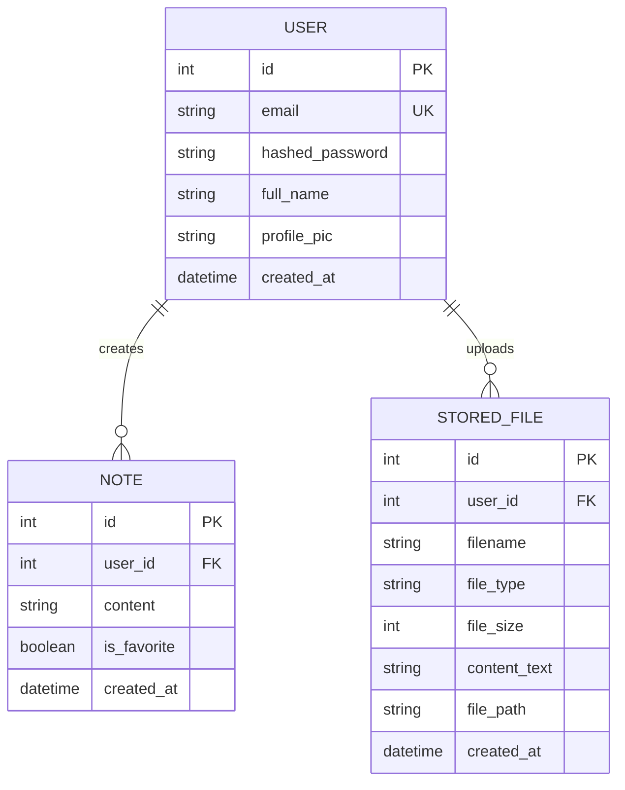
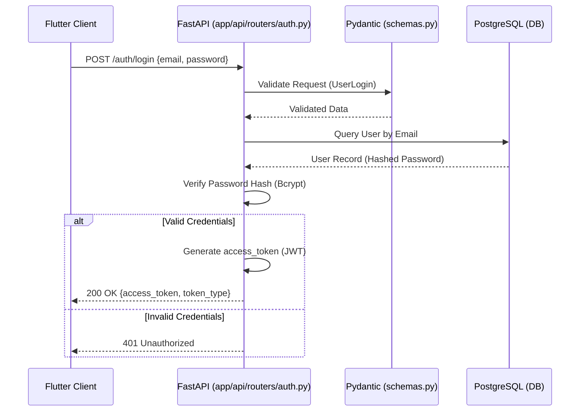
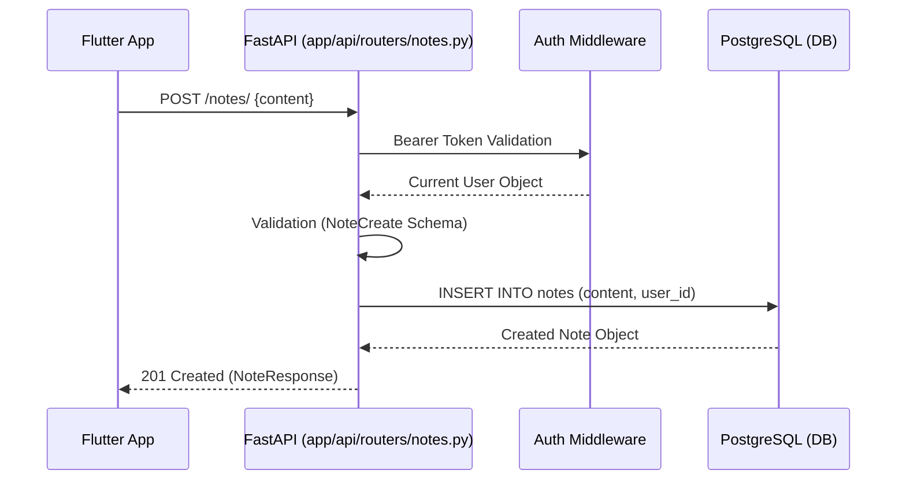
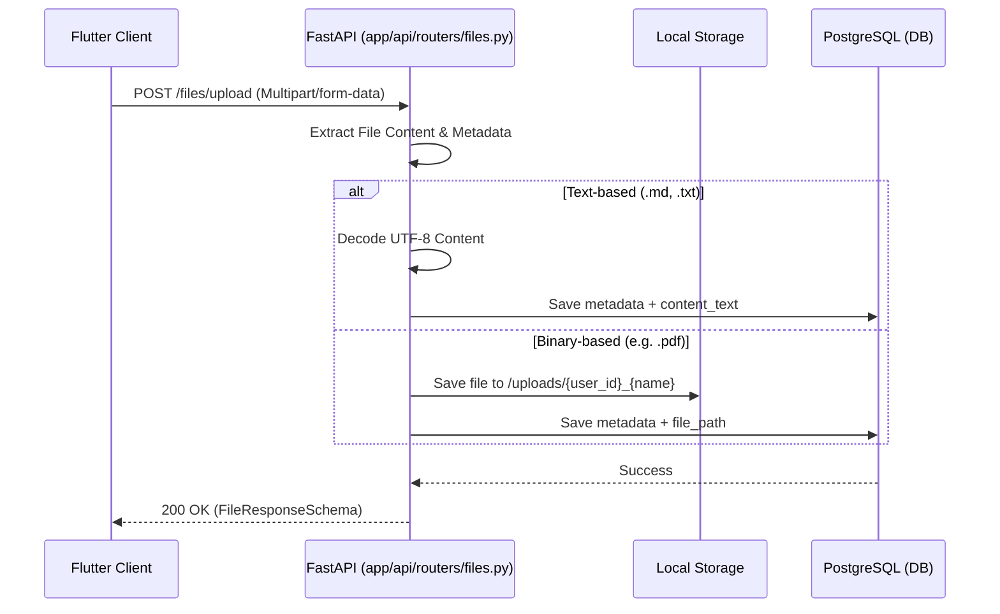
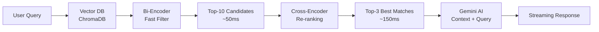
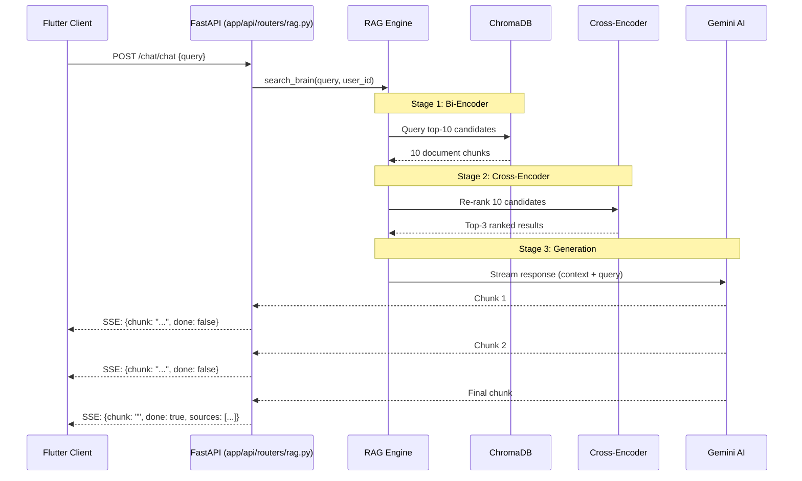
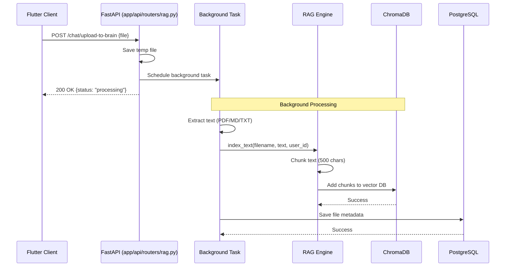

# Brain Dump Backend Documentation

## 1. System Overview
The Brain Dump backend is a high-performance API built with **FastAPI**, designed to handle user authentication, note management, and file storage for "The Vault".

### Technical Stack
- **Framework**: FastAPI (Python 3.13+)
- **Database**: PostgreSQL
- **ORM**: SQLAlchemy
- **Authentication**: JWT (JSON Web Tokens) with OAuth2 Password Bearer flow
- **Validation**: Pydantic v2
- **File Storage**: Local Disk Storage (for binary files) & Database (for metadata and text content)

### Folder Structure
```text
backend/
├── app/
│   ├── api/
│   │   └── routers/     # API Endpoints (auth, files, notes, rag, analytics)
│   ├── core/            # Configuration, limitation, and database logic
│   ├── models/          # SQLAlchemy Database Models
│   ├── schemas/         # Pydantic Schemas for Validation
│   ├── services/        # Business logic (e.g. rag_engine.py)
│   └── main.py          # Application entry point & router registration
├── scripts/             # Admin, migration, and re-indexing scripts
└── postgres_data/       # Persistent database volumes
```

---

## 2. Database Schema (ERD)
The database uses a relational schema with a one-to-many relationship from the User to their Notes and Files.



---

## 3. Critical Backend Flows

### Flow A: Authentication (Login)
Handles credential verification and JWT generation.



### Flow B: The "Quick Save" (Text Note)
Persists user thoughts directly to the database.



### Flow C: File Upload (The Vault)
Handles multi-modal storage for markdown, text, and binary files.



---

## 4. RAG System (Retrieval-Augmented Generation)

### Overview
The Brain Dump backend includes an intelligent RAG system that allows users to query their uploaded files and notes using natural language. The system uses **two-stage retrieval** with cross-encoder re-ranking for 15-25% better accuracy.

### Architecture



### Key Components

#### 1. Vector Database (ChromaDB)
- **Embedding Model**: `all-MiniLM-L6-v2` (384 dimensions)
- **Storage**: Local persistent storage in `brain_storage/`
- **Chunking**: RecursiveCharacterTextSplitter (500 chars, 50 overlap)
- **User Isolation**: Metadata filtering by `user_id`

#### 2. Two-Stage Retrieval Pipeline

**Stage 1: Bi-Encoder (Fast Filtering)**
- Retrieves top-10 candidates using semantic similarity
- Fast (~50ms) because document vectors are pre-computed
- Uses cosine similarity for ranking

**Stage 2: Cross-Encoder (Accurate Ranking)**
- Re-ranks 10 candidates using `ms-marco-MiniLM-L-6-v2`
- Understands query-document relationship contextually
- Selects top-3 most relevant results (~150ms)
- **Accuracy improvement**: +15-25% over bi-encoder alone

#### 3. AI Generation (Gemini)
- **Model**: `gemini-3-flash-preview`
- **Temperature**: 0.3 (factual responses)
- **Streaming**: Server-Sent Events (SSE) for real-time responses
- **Context Window**: Top-3 documents + user query

### Configuration

```python
# In rag_engine.py
RERANKING_ENABLED = True  # Toggle re-ranking on/off
N_CANDIDATES = 10  # Number of candidates for re-ranking
N_FINAL_RESULTS = 3  # Final results sent to AI
CROSS_ENCODER_MODEL = 'cross-encoder/ms-marco-MiniLM-L-6-v2'
```

### Performance Metrics

| Metric | Value |
|--------|-------|
| **Retrieval Accuracy** | 80-90% (up from 65-70%) |
| **Total Latency** | ~200ms (retrieval) + ~300ms (AI first chunk) |
| **Memory Usage** | ~180MB (both models + index) |
| **Scalability** | Handles millions of documents |

### Flow D: RAG Chat Query (with Re-ranking)



### Flow E: File Upload to RAG (Background Processing)



---

## 5. API Reference

| Method | Endpoint | Description | Input Schema |
| :--- | :--- | :--- | :--- |
| `POST` | `/auth/signup` | Register a new user | `UserCreate` |
| `POST` | `/auth/login` | Authenticate and get JWT | `UserLogin` |
| `GET` | `/auth/me` | Get current user info | `None` (Bearer) |
| `POST` | `/notes/` | Create a new quick note | `NoteCreate` |
| `GET` | `/notes/` | List all user notes | `None` (Bearer) |
| `POST` | `/files/upload` | Upload file to Vault | `Multipart/Form` |
| `GET` | `/files/` | List all user files | `None` (Bearer) |
| `GET` | `/files/{id}` | Get file content or download | `None` (Bearer) |
| **`POST`** | **`/chat/upload-to-brain`** | **Upload file to RAG system** | **`Multipart/Form`** |
| **`POST`** | **`/chat/chat`** | **Query RAG with streaming** | **`ChatRequest`** |
| **`GET`** | **`/chat/files`** | **List RAG-indexed files** | **`None` (Bearer)** |
| **`DELETE`** | **`/chat/files/{id}`** | **Delete file from RAG** | **`None` (Bearer)** |
| `GET` | `/analytics/consistency` | Get streak & heatmap | `None` (Bearer) |
| `GET` | `/analytics/themes` | Topic frequency/pct last 30 days | `None` (Bearer) |
| `GET` | `/analytics/loops` | Recurring thought clusters | `None` (Bearer) |
| `GET` | `/analytics/pipeline` | Thought pipeline graph | `None` (Bearer) |

### RAG Endpoints Details

#### POST `/chat/upload-to-brain`
**Purpose**: Upload and index files into the RAG system  
**Processing**: Background task (non-blocking)  
**Supported formats**: PDF, MD, TXT, JSON, PY, DART, YAML, CSV  
**Response**:
```json
{
  "status": "processing",
  "message": "Memorizing filename.md in background...",
  "type": "text/markdown"
}
```

#### POST `/chat/chat`
**Purpose**: Query the RAG system with natural language  
**Response Type**: Server-Sent Events (SSE) streaming  
**Request**:
```json
{
  "query": "What did I say about FastAPI deployment?"
}
```
**Response Stream**:
```
data: {"chunk": "Based on your notes, ", "done": false}
data: {"chunk": "you mentioned that...", "done": false}
data: {"chunk": "", "done": true, "sources": ["deployment.md"]}
```

---

## 6. RAG Optimization Details

### Why Two-Stage Retrieval?

**Problem**: Bi-encoders are fast but less accurate  
**Solution**: Combine bi-encoder (speed) + cross-encoder (accuracy)

**Bi-Encoder**:
- Encodes query and documents separately
- Fast: Can pre-compute document vectors
- Less accurate: Doesn't see query-document relationship

**Cross-Encoder**:
- Encodes query + document together
- Slow: Must compute for each pair
- More accurate: Understands full context

**Our Approach**:
1. Bi-encoder filters 10,000 docs → 10 candidates (fast)
2. Cross-encoder ranks 10 candidates → 3 best (accurate)
3. Result: Speed + Accuracy ✅

### Performance Comparison

| Approach | Latency | Accuracy | Scalability |
|----------|---------|----------|-------------|
| Bi-encoder only | 50ms | 65-70% | ✅ Millions |
| Cross-encoder only | 100s | 90-95% | ❌ ~100 docs |
| **Two-stage (Ours)** | **200ms** | **80-90%** | ✅ **Millions** |

### Configuration Options

**Toggle re-ranking**:
```python
RERANKING_ENABLED = False  # Disable for testing/debugging
```

**Adjust candidates**:
```python
N_CANDIDATES = 5  # Fewer for speed, more for recall
```

**Change model**:
```python
# Faster but less accurate
CROSS_ENCODER_MODEL = 'cross-encoder/ms-marco-TinyBERT-L-2-v2'

# Slower but more accurate
CROSS_ENCODER_MODEL = 'cross-encoder/ms-marco-MiniLM-L-12-v2'
```

---

## 7. Documentation References

For detailed RAG system documentation, see:
- **[RAG_OPTIMIZATION_SUMMARY.md](./rag/RAG_OPTIMIZATION_SUMMARY.md)** - Quick reference
- **[RAG_OPTIMIZATION_CONCEPTS.md](./rag/RAG_OPTIMIZATION_CONCEPTS.md)** - Technical deep dive


---

## 8. Feature Integrations

### Location & Music Context API

### Phase 1: Data Collection (Backend)

#### A. Spotify Integration
```python
import spotipy
from spotipy.oauth2 import SpotifyOAuth

# Setup
SPOTIFY_CLIENT_ID = os.getenv("SPOTIFY_CLIENT_ID")
SPOTIFY_CLIENT_SECRET = os.getenv("SPOTIFY_CLIENT_SECRET")
SPOTIFY_REDIRECT_URI = "http://localhost:8000/callback"

sp = spotipy.Spotify(auth_manager=SpotifyOAuth(
    client_id=SPOTIFY_CLIENT_ID,
    client_secret=SPOTIFY_CLIENT_SECRET,
    redirect_uri=SPOTIFY_REDIRECT_URI,
    scope="user-read-recently-played user-read-currently-playing"
))

def get_recent_music_context(user_id: int, limit=10):
    """Fetch recently played tracks and extract emotional/contextual signals"""
    
    try:
        # Get recently played tracks
        results = sp.current_user_recently_played(limit=limit)
        
        tracks_data = []
        for item in results['items']:
            track = item['track']
            played_at = item['played_at']  # Timestamp
            
            tracks_data.append({
                'name': track['name'],
                'artist': track['artists'][0]['name'],
                'played_at': played_at,
                'energy': track.get('energy', 0.5),  # Spotify audio features
                'valence': track.get('valence', 0.5),  # Positivity measure
                'tempo': track.get('tempo', 120)
            })
        
        return tracks_data
    
    except Exception as e:
        print(f"Spotify Error: {e}")
        return []

def analyze_music_mood(tracks_data):
    """Analyze emotional state from music choices"""
    
    if not tracks_data:
        return None
    
    # Calculate average valence (happiness) and energy
    avg_valence = sum(t.get('valence', 0.5) for t in tracks_data) / len(tracks_data)
    avg_energy = sum(t.get('energy', 0.5) for t in tracks_data) / len(tracks_data)
    
    # Classify mood
    if avg_valence > 0.6 and avg_energy > 0.6:
        mood = "energized_positive"
        description = "High energy, upbeat vibes"
    elif avg_valence > 0.6 and avg_energy < 0.4:
        mood = "calm_content"
        description = "Peaceful, content energy"
    elif avg_valence < 0.4 and avg_energy > 0.6:
        mood = "intense_processing"
        description = "Intense, possibly working through something"
    else:
        mood = "reflective_melancholic"
        description = "Reflective, introspective mood"
    
    recent_artists = [t['artist'] for t in tracks_data[:3]]
    
    return {
        'mood': mood,
        'description': description,
        'recent_tracks': [f"{t['name']} - {t['artist']}" for t in tracks_data[:3]],
        'recent_artists': recent_artists,
        'avg_energy': round(avg_energy, 2),
        'avg_valence': round(avg_valence, 2)
    }
```

#### B. Apple Music Integration (Alternative)
```python
import requests

# Apple Music uses MusicKit JS on frontend + Apple Music API on backend
# Requires Apple Developer account

def get_apple_music_recent(user_token: str):
    """Fetch from Apple Music API"""
    
    headers = {
        'Authorization': f'Bearer {APPLE_MUSIC_DEVELOPER_TOKEN}',
        'Music-User-Token': user_token
    }
    
    url = "https://api.music.apple.com/v1/me/recent/played"
    
    response = requests.get(url, headers=headers)
    
    if response.status_code == 200:
        data = response.json()
        # Parse similar to Spotify
        return data
    
    return None
```

### Phase 2: Contextual Retrieval

```python
def retrieve_context_enhanced(query: str, user_id: int, 
                               current_music: dict = None,
                               current_location: dict = None):
    """Enhanced retrieval with music/location awareness"""
    
    # Standard retrieval
    context_text, sources = retrieve_context(query, user_id)
    
    # Extract metadata from retrieved chunks
    collection = get_db_collection()
    results = collection.query(
        query_texts=[query],
        n_results=5,
        where={"user_id": user_id},
        include=["metadatas", "documents"]
    )
    
    contextual_insights = []
    
    if results['metadatas'] and results['metadatas'][0]:
        for metadata in results['metadatas'][0]:
            
            # Music pattern detection
            if current_music and metadata.get('music_mood'):
                if current_music['mood'] == metadata['music_mood']:
                    contextual_insights.append(
                        f"Same music vibe as when you wrote this: {metadata.get('music_mood')}"
                    )
            
            # Location pattern detection
            if current_location and metadata.get('location_type'):
                if current_location['location_type'] == metadata['location_type']:
                    contextual_insights.append(
                        f"You're at a {current_location['location_type']} again - like when you wrote this"
                    )
    
    # Add contextual layer to prompt
    if contextual_insights:
        context_text += "\n\n[CONTEXTUAL PATTERNS]:\n" + "\n".join(contextual_insights)
    
    return context_text, sources
```

---

### Phase 3: Subconscious Integration

```python
def ask_gemini_stream_full_context(context: str, query: str, user_id: int = 1,
                                     music_context: dict = None,
                                     location_context: dict = None):
    """
    COMPLETE SUBCONSCIOUS with Music + Location awareness
    """
    
    # Build sensory context
    sensory_context = []
    
    # Music awareness
    if music_context:
        mood_desc = music_context.get('description', '')
        recent = ', '.join(music_context.get('recent_tracks', [])[:2])
        sensory_context.append(f"MUSIC: {mood_desc}. Recently: {recent}")
    
    # Location awareness
    if location_context:
        loc_type = location_context.get('location_type', 'unknown')
        city = location_context.get('city', '')
        
        # Time-aware location context
        hour = datetime.now().hour
        if loc_type == "home" and (hour >= 22 or hour <= 5):
            sensory_context.append(f"LOCATION: Home, late night - deep thought territory")
        elif loc_type == "cafe":
            sensory_context.append(f"LOCATION: Coffee shop - planning mode")
        elif loc_type == "gym":
            sensory_context.append(f"LOCATION: Gym area - motivation context")
        else:
            sensory_context.append(f"LOCATION: {city}, {loc_type}")
    
    sensory_layer = "\n".join(sensory_context) if sensory_context else ""
    
    # Enhanced system instruction
    system_instruction = f"""You are Siddhant's subconscious mind.

TODAY: {datetime.now().strftime('%B %d, %Y, %I:%M %p')}

CURRENT SENSORY STATE:
{sensory_layer}

HOW TO USE THIS:
- If music mood matches past note's music mood → mention it: "Same energy as when you wrote X"
- If location triggers patterns → surface them: "Every time you're here, you think about Y"
- If music + location create unique context → name it: "Coffee shop + chill beats = strategy time for you"

SPEAK AS SUBCONSCIOUS:
• No "I found" or "Based on your notes"
• Make unexpected connections between music, place, memory
• Echo his patterns back to him
• Be intimate - you share his sensory experience

EXAMPLES:
"You're listening to lo-fi again. Last time this playlist was on, you solved that problem you're asking about now."

"This coffee shop + morning combo. Three times here, three breakthrough notes. What's brewing?"

"Frank Ocean at midnight. You know what this means - you're processing something big."

MEMORY FRAGMENTS:
{context}

USER QUESTION: {query}

[Respond as his subconscious - aware of music, place, and memory]
"""

    # ... rest of streaming implementation ...
```

---


### Analytics Engine API
The analytics system provides four primary endpoints located in `app/api/routers/analytics.py`. It uses a mix of standard relational database queries and vector database approximate nearest neighbors (ANN) to detect patterns.

1. **`GET /analytics/consistency`**: Returns daily note-taking streaks and a 30-day heatmap.
2. **`GET /analytics/themes`**: Keyword-based theme frequency over the last N days (Work, Money, Relationships, Health, etc.).
3. **`GET /analytics/loops`**: Uses Vector L2 distance clustering (Union-Find) to detect recurring similar thoughts and generates severity insights.
4. **`GET /analytics/pipeline`**: Maps notes into categorised thought lanes (Work, Health, Personal) for graph visualization.

---

## 9. Subconscious Feel Engine

The "Subconscious Feel" makes the RAG queries feel like an internal monologue rather than an AI assistant. This is implemented in `app/services/rag_engine.py` via special context injection before prompting the LLM.

### Implemented Layers
- **Layer 1: Language & Tone Design**: The system prompt forces a fragmented, conversational internal monologue without AI pleasantries.
- **Layer 2: Temporal Awareness**: Injects awareness of the time of day, day of the week, and upcoming events (`get_temporal_context`).
- **Layer 3: Emotional Intelligence**: Uses `TextBlob` to analyze the sentiment polarity of the retrieved context and adjusts the AI's guidance tone (e.g. gentle vs. energized) (`analyze_emotional_tone`).

*(Note: Extended sensory associations like Music patterns or "PathEngine" forward-guidance are planned for future iterations rather than current deployment.)*
