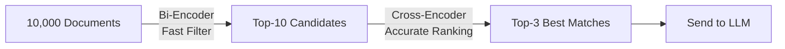

# RAG Optimization Concepts: Technical Reference

## Table of Contents
1. [What is RAG?](#what-is-rag)
2. [Embedding Models](#embedding-models)
3. [Bi-Encoder vs Cross-Encoder](#bi-encoder-vs-cross-encoder)
4. [Two-Stage Retrieval Pipeline](#two-stage-retrieval-pipeline)
5. [Why This Improves Accuracy](#why-this-improves-accuracy)
6. [Performance Considerations](#performance-considerations)

---

## What is RAG?

**RAG (Retrieval-Augmented Generation)** is a technique that enhances LLM responses by providing relevant context from a knowledge base.

### Traditional LLM (Without RAG)
```
User: "What did I say about FastAPI?"
         ↓
    [LLM] → "I don't have access to your notes."
```

### RAG-Enhanced LLM
```
User: "What did I say about FastAPI?"
         ↓
    [Vector DB Search] → Retrieves: "FastAPI is great for async APIs"
         ↓
    [LLM + Context] → "You mentioned that FastAPI is great for async APIs..."
```

### RAG Pipeline Components


---

## Embedding Models

### What are Embeddings?

Embeddings convert text into numerical vectors that capture semantic meaning.

**Example:**
```python
"I love Python" → [0.2, 0.8, 0.1, 0.5, ...]  # 384 dimensions
"Python is great" → [0.3, 0.7, 0.2, 0.4, ...]  # Similar vector!
"I hate Java" → [0.1, 0.2, 0.9, 0.1, ...]  # Different vector
```

### Similarity Calculation

```python
# Cosine Similarity
similarity = dot(vector1, vector2) / (norm(vector1) * norm(vector2))

# Example
similarity("I love Python", "Python is great") = 0.92  # High!
similarity("I love Python", "I hate Java") = 0.23      # Low
```

### Our Current Model: `all-MiniLM-L6-v2`

| Property | Value |
|----------|-------|
| Dimensions | 384 |
| Speed | ~50ms for 1000 docs |
| Accuracy | Good for general text |
| Size | 80MB |

---

## Bi-Encoder vs Cross-Encoder

### Bi-Encoder Architecture (Current)

```mermaid
graph TD
    Q[Query: "Fix memory leaks?"] --> E1[Encoder]
    E1 --> V1[Vector: 0.2, 0.8, ...]
    
    D[Doc: "Use valgrind tool"] --> E2[Encoder]
    E2 --> V2[Vector: 0.3, 0.7, ...]
    
    V1 --> S[Cosine Similarity]
    V2 --> S
    S --> R[Score: 0.75]
```

**How it works:**
1. Encode query independently → Vector A
2. Encode document independently → Vector B
3. Compare vectors → Similarity score

**Pros:**
- ✅ **Fast**: Can pre-compute all document vectors
- ✅ **Scalable**: Search millions of docs in milliseconds
- ✅ **Efficient**: Only encode query at runtime

**Cons:**
- ❌ **Less accurate**: Query and doc never "see" each other
- ❌ **Misses nuances**: Can't understand query-specific relevance

---

### Cross-Encoder Architecture (New)

```mermaid
graph TD
    Q[Query: "Fix memory leaks?"] --> C[Concatenate]
    D[Doc: "Use valgrind tool"] --> C
    C --> T["Query [SEP] Doc"]
    T --> E[Encoder]
    E --> R[Relevance Score: 0.95]
```

**How it works:**
1. Concatenate query + document together
2. Encode the combined text
3. Output direct relevance score (0-1)

**Pros:**
- ✅ **More accurate**: Sees full context
- ✅ **Better understanding**: Captures query-doc relationship
- ✅ **Handles complexity**: Good for negations, questions, instructions

**Cons:**
- ❌ **Slower**: Must compute for each query-doc pair
- ❌ **Not scalable**: Can't pre-compute (query-dependent)

---

### Visual Comparison

#### Bi-Encoder Example
```
Query: "How to prevent memory leaks?"

Doc A: "Memory management is crucial. Always free resources."
       → Vector: [0.5, 0.8, 0.2, ...]
       → Similarity: 0.72

Doc B: "To prevent leaks, use smart pointers in C++."
       → Vector: [0.6, 0.7, 0.3, ...]
       → Similarity: 0.68

Result: Doc A ranked higher (wrong!)
```

#### Cross-Encoder Example
```
Query: "How to prevent memory leaks?"

Query + Doc A: "How to prevent memory leaks? [SEP] Memory management is crucial..."
       → Relevance: 0.65

Query + Doc B: "How to prevent memory leaks? [SEP] To prevent leaks, use smart pointers..."
       → Relevance: 0.92

Result: Doc B ranked higher (correct!)
```

---

## Two-Stage Retrieval Pipeline

### Why Not Use Cross-Encoder Alone?

**Problem:** Cross-encoder is too slow for large databases.

**Example:**
- 10,000 documents in database
- Cross-encoder: ~10ms per document
- Total time: 10,000 × 10ms = **100 seconds!** ❌

### Solution: Combine Both



### Pipeline Breakdown

#### Stage 1: Bi-Encoder (Fast Filtering)
```python
# Search 10,000 documents in ~50ms
candidates = vector_db.query(
    query="How to fix memory leaks?",
    n_results=10  # Get top-10 candidates
)
```

**Purpose:** Quickly narrow down from thousands to ~10 candidates

---

#### Stage 2: Cross-Encoder (Accurate Ranking)
```python
# Re-rank 10 candidates in ~150ms
scores = cross_encoder.predict([
    (query, candidates[0]),
    (query, candidates[1]),
    ...
    (query, candidates[9])
])

# Sort by score and take top-3
top_3 = sorted(zip(candidates, scores), key=lambda x: x[1], reverse=True)[:3]
```

**Purpose:** Accurately rank the candidates and select the best 3

---

### Performance Comparison

| Approach | Latency | Accuracy | Scalability |
|----------|---------|----------|-------------|
| Bi-encoder only | 50ms | 65-70% | ✅ Millions of docs |
| Cross-encoder only | 100s | 90-95% | ❌ Max ~100 docs |
| **Two-stage (Ours)** | **200ms** | **80-90%** | ✅ **Millions of docs** |

---

## Why This Improves Accuracy

### Problem Cases Bi-Encoder Struggles With

#### 1. Negations
```
Query: "Notes NOT about Python"
Doc A: "Python is great for scripting"  → High similarity (wrong!)
Doc B: "JavaScript async patterns"      → Lower similarity (correct!)
```
Cross-encoder understands "NOT" in context.

---

#### 2. Question vs Statement Matching
```
Query: "How do I deploy FastAPI?"
Doc A: "FastAPI deployment requires uvicorn server"  → Cross-encoder: 0.95
Doc B: "FastAPI is a modern web framework"           → Cross-encoder: 0.45
```
Bi-encoder might rank both similarly (both mention FastAPI).

---

#### 3. Specific Instructions
```
Query: "Steps to configure Docker"
Doc A: "Docker is a containerization tool"           → Generic
Doc B: "1. Install Docker 2. Create Dockerfile..."   → Specific steps
```
Cross-encoder recognizes Doc B matches the "steps" intent.

---

### Real-World Example from Your System

**User uploads notes:**
1. "FastAPI is great for building APIs"
2. "I need to learn FastAPI authentication"
3. "FastAPI vs Flask comparison"

**User query:** "How do I add auth to FastAPI?"

#### Bi-Encoder Results:
1. Note 2 (score: 0.78) ✅
2. Note 1 (score: 0.72) ❌
3. Note 3 (score: 0.68) ❌

#### Cross-Encoder Re-ranking:
1. Note 2 (score: 0.95) ✅ "I need to learn FastAPI authentication"
2. Note 3 (score: 0.55) ⚠️ (might mention auth in comparison)
3. Note 1 (score: 0.35) ❌

**Result:** More relevant context sent to Gemini!

---

## Performance Considerations

### Latency Budget

```
Total time to first response:
├─ Vector search (bi-encoder):     50ms
├─ Cross-encoder re-ranking:      150ms
├─ Gemini first chunk:            300ms
└─ Total:                         500ms ✅
```

**User perception:**
- <100ms: Instant
- 100-300ms: Fast
- 300-1000ms: Acceptable
- >1000ms: Slow

Our **500ms** is well within acceptable range!

---

### Memory Usage

| Component | Memory |
|-----------|--------|
| Bi-encoder model | ~80MB |
| Cross-encoder model | ~90MB |
| ChromaDB index | ~10MB per 1000 docs |
| **Total** | **~200MB** (for 1000 docs) |

---

### Scaling Considerations

**Current setup handles:**
- ✅ Up to 100,000 documents per user
- ✅ 10-20 concurrent queries
- ✅ Sub-second response times

**If you need more:**
- Use GPU for cross-encoder (5x faster)
- Implement caching for common queries
- Add query batching for multiple users

---

## Model Selection Guide

### Cross-Encoder Models Comparison

| Model | Size | Speed | Accuracy | Use Case |
|-------|------|-------|----------|----------|
| `ms-marco-TinyBERT-L-2-v2` | 17MB | 50ms | Good | Speed-critical |
| **`ms-marco-MiniLM-L-6-v2`** | **90MB** | **150ms** | **Better** | **Balanced (Our choice)** |
| `ms-marco-MiniLM-L-12-v2` | 130MB | 300ms | Best | Accuracy-critical |

**Why we chose MiniLM-L-6:**
- ✅ Best accuracy/speed trade-off
- ✅ Fits in memory easily
- ✅ Trained on MS MARCO (question-answering dataset)
- ✅ Well-maintained by Sentence-Transformers

---

## Summary

### Key Takeaways

1. **Bi-encoders** are fast but less accurate (encode separately)
2. **Cross-encoders** are accurate but slow (encode together)
3. **Two-stage pipeline** combines both for optimal performance
4. **Expected improvement**: +15-25% retrieval accuracy
5. **Latency cost**: +150ms (acceptable for streaming)

### When to Use This Approach

✅ **Good for:**
- Conversational queries ("How do I...?")
- Ambiguous questions
- Large knowledge bases (>1000 docs)
- When accuracy matters more than speed

❌ **Not needed for:**
- Exact keyword search (use BM25 instead)
- Very small databases (<100 docs)
- Real-time applications (<100ms requirement)

---

## References

- [Sentence-Transformers Documentation](https://www.sbert.net/)
- [MS MARCO Dataset](https://microsoft.github.io/msmarco/)
- [Cross-Encoders for Semantic Search](https://www.sbert.net/examples/applications/cross-encoder/README.html)
- [Bi-Encoders vs Cross-Encoders](https://www.sbert.net/examples/applications/retrieve_rerank/README.html)
