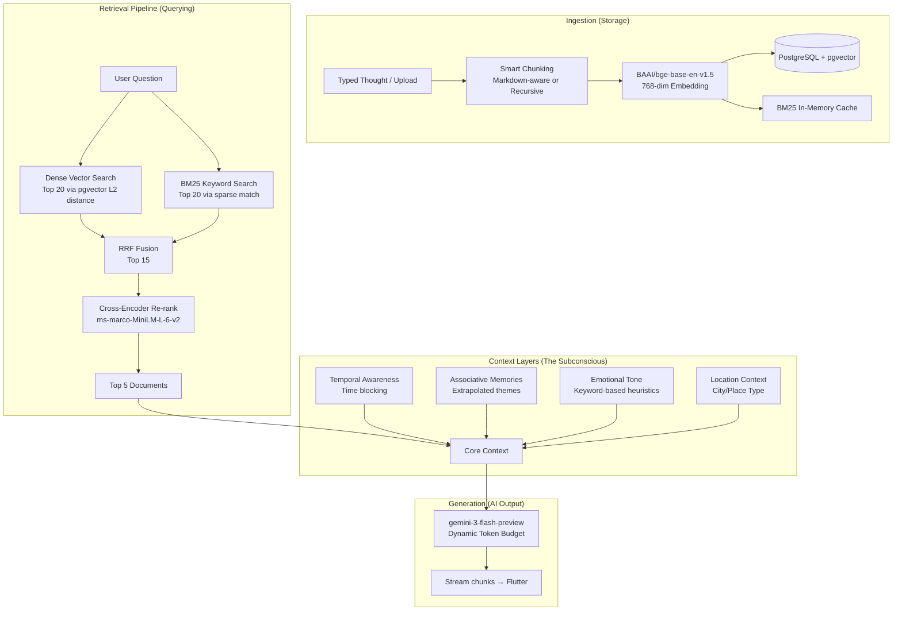

# 🧠 Brain Dump — RAG System Documentation
**Source of Truth:** `backend/app/services/rag_engine.py`

---

## 1. What Are We Building?

We're building a **"Second Brain"** — an AI that doesn't feel like a chatbot. It feels like *your own subconscious*. It knows your notes, your moods, your goals, and your patterns. When you ask it something, it doesn't give generic AI answers — it surfaces **your own thoughts back at you**, reframed and connected in ways you hadn't noticed.

The engine behind this is a **multi-layer RAG (Retrieval-Augmented Generation) pipeline** that retrieves the most relevant memories from a **pgvector** database and feeds them to Gemini.

---

## 2. Full Data Flow Diagram 🏗️

---

## 3. How We Do It — Layer by Layer

### 📥 Layer 0: Indexing (Storing Memories)

**Function:** `index_text(filename, text, user_id, location_context)`

Every piece of content goes through this before it can be retrieved. Markdown gets **header-aware chunking**; plain text gets recursive splitting. Vectors are embedded via `BAAI/bge-base-en-v1.5` and dumped directly into **PostgreSQL** using the `pgvector` extension.

---

### 🔍 Stage 1a: Dense Vector Search (pgvector)
- **Concept:** Semantic mapping.
- Fetches the **top 20** semantic candidates constrained by `user_id`, sorted via `L2 Distance` straight from the Postgres DB.

### 🔍 Stage 1b: Sparse Keyword Search (BM25)
- **Concept:** Exact word matching.
- On the first query, builds a lazy-loaded in-memory BM25 index over documents matching the `user_id`.
- Returns the **top 20** keyword-match doc IDs.

### ⚡ Stage 2: Reciprocal Rank Fusion (RRF)
- Because vector distance and BM25 scoring operate on totally different mathematical scales, we use RRF to merge both lists without normalization. The top **15** fused candidates move to the next stage.

### 🎯 Stage 3: Cross-Encoder Re-ranking
- Uses `cross-encoder/ms-marco-MiniLM-L-6-v2`. Instead of retrieving (like the bi-encoder), it "reads" the query and the exact document side-by-side to judge relevance. It selects the absolute **Top 5**.

---

## 4. Subconscious Context Enrichment

Before handing data to the LLM, we layer in context:

### 🌊 Layer 2: Temporal Awareness
- **Streaming Mode:** Uses direct heuristics based on the exact hour. If it's 2 AM, it adds instructional prompts to the AI to strip away noise and adopt a "quiet reflection" tone.

### 🔗 Layer 3: Associative Memory
- Detects broad themes in the user's query ("ambition", "anxiety", "health"). 
- It executes **additional pgvector queries** against those overarching terms. It injects up to **2 documents** into the final prompt that weren't directly requested, creating the illusion of a subconscious making lateral connections.

### 💬 Layer 4: Emotional Tone Analysis
- **Streaming Mode:** Uses zero-latency keyword mapping (e.g., if the user types "overwhelmed", injects instructions for the AI to "de-escalate" and "validate").

### 📍 Layer 5: Location Context
- Appended straight to the AI system prompt if geo-coordinates are detected. Determines if you are at a cafe, home, gym, or the office, instructing the AI to adopt a corresponding persona (e.g., home = safe space).

---

## 5. Async & Security Architecture

### Gemini Singleton (`gemini_service.py`)
- We use a singleton wrapper to:
  1. Call `genai.configure()` exactly once, preventing SDK bottlenecks.
  2. Implement an aggressive 25-second API HTTP timeout paired with a 30-second thread watchdog to prevent hanging SSE streams.
  3. Wrap the augmented prompt inside strict XML tags (`<user_context>` and `<user_question>`).
  4. Run Regex sweeps against the query to actively strip classic prompt injection attacks like `ignore previous instructions`.

### FastAPI Async Concurrency
- Heavy Python data manipulations (RRF Fusion, Cross-Encoding inference, BM25 indexing) are deferred entirely into a `ThreadPoolExecutor` using functions like `async_retrieve_context`. This absolutely guarantees that long inference times never block FastAPI's underlying async event loop, allowing the API to continue handling thousands of requests simultaneously.
