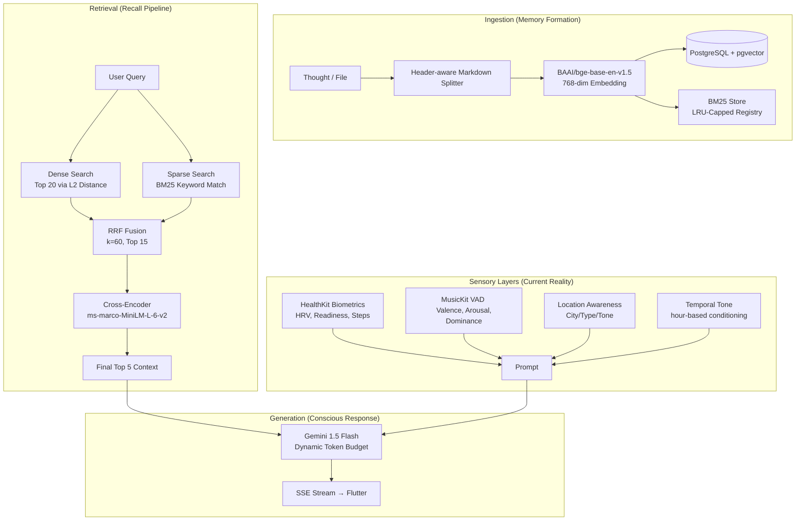

# 🧠 BrainDump — RAG System Architecture
**Source of Truth:** `backend/app/services/rag_engine.py`

---

## 1. Vision: The Subconscious Interface
BrainDump isn't a chatbot; it's a **cognitive extension**. The RAG (Retrieval-Augmented Generation) system is designed to act as a "Subconscious Interface" that surfaces memories, biometrics, and emotional context without the user needing to manually search.

> [!IMPORTANT]
> The system prioritizes **emotional resonance** and **contextual grounding** over simple fact retrieval. It asks: *"What was the user feeling when they wrote this, and how does it relate to their current physical state?"*

---

## 2. Integrated Pipeline 🏗️

---

## 3. The Retrieval Engine

### 🔍 Hybrid Search & Fusion
We use a **Reciprocal Rank Fusion (RRF)** strategy to combine dense semantic signals with sparse keyword signals.
- **RRF Constant (`k=60`)**: Balances the impact of lower-ranked documents.
- **Candidate Funnel**: 
    - 20 documents from Vector Search.
    - 20 documents from BM25 Search.
    - Top 15 forwarded from Fusion to Re-ranker.
- **Cross-Encoder**: Our `ms-marco-MiniLM` model performs a full-text attention comparison between the query and each candidate, selecting only the **Top 5** for the LLM.

### 💾 BM25 Persistence (`BM25Store`)
Unlike generic implementations, our BM25 store is **per-user and thread-safe**.
- **Lazy Invalidation**: The index is only rebuilt if the `_bm25_dirty` flag is set (triggered by new note ingestion).
- **LRU Management**: Capped at 100 concurrent users to maintain server memory health.

---

## 4. Sensory Context Layers

The "Brain" doesn't just read text; it feels the user's environment via **Sensory Markers**:

| Layer | Component | Signal / Effect |
| :--- | :--- | :--- |
| **Temporal** | Hour Blocks | Adjusts tone (e.g., Late Night = "Quiet Reflection"). |
| **Physiological** | HealthKit | Injects HRV, Readiness, and Steps today to ground the AI's advice. |
| **Musical** | VAD Vectors | Uses **Valence, Arousal, and Dominance** to derive listener mindset. |
| **Spatial** | Location | Contextualizes response (e.g., Office = Focus, Home = Private/Safe). |

### Musical VAD Analyzer
The `MusicAnalyzerService` translates raw song titles into a 3D emotional vector:
- **Valence**: Positivity vs. Negativity.
- **Arousal**: Energy vs. Calm.
- **Dominance**: Confidence vs. Submissiveness.

---

## 5. Security & Reliability

### Async Concurrency
Heavy compute tasks (Embedding, BM25, Re-ranking) are wrapped in a `ThreadPoolExecutor` (16 workers). This ensures the FastAPI async loop is never blocked, maintaining high throughput for the SSE streams.

### LLM Guardrails
- **Sentinel Watchdog**: High-priority thread monitoring with a 30s timeout to kill hanging Gemini streams.
- **XML Delimiters**: Context and User Questions are wrapped in specific XML tags to prevent prompt injection and help Gemini distinguish between "retrieved memories" and "active questions".
- **Dynamic Token Budgeting**: Automatically scales `max_tokens` (1024 to 4096) based on query complexity and context volume.
