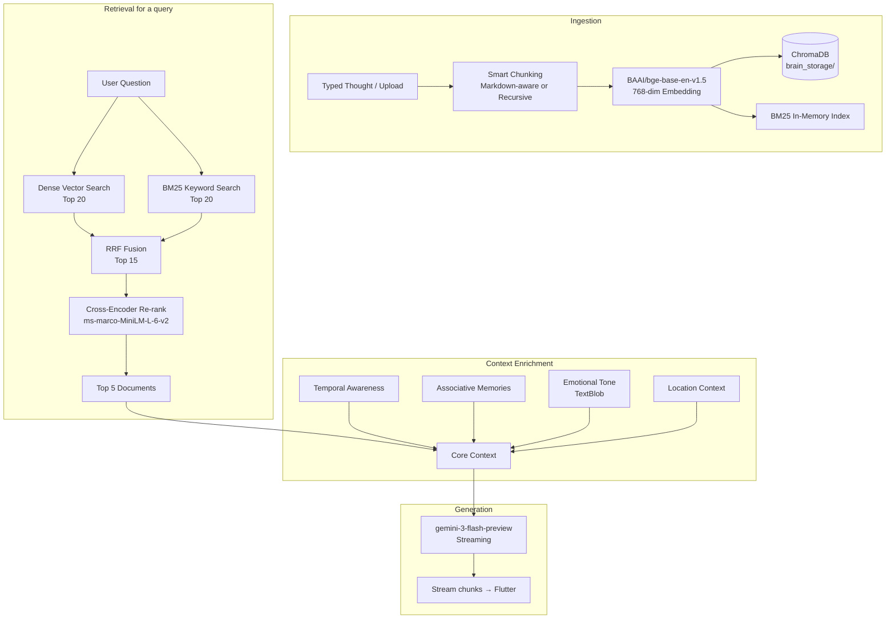

# 🧠 Brain Dump — RAG System Documentation
**Last Updated:** February 20, 2026  
**Source of Truth:** `backend/app/services/rag_engine.py`

---

## What Are We Building?

We're building a **"Second Brain"** — an AI that doesn't feel like a chatbot. It feels like *your own subconscious*. It knows your notes, your moods, your goals, and your patterns. When you ask it something, it doesn't give generic AI answers — it surfaces **your own thoughts back at you**, reframed and connected in ways you hadn't noticed.

The engine behind this is a **multi-layer RAG (Retrieval-Augmented Generation) pipeline** that retrieves the most relevant memories and feeds them to Gemini before it generates a response.

---

## High-Level Architecture

```
[ User types a thought / uploads a file ]
         ↓
   ┌─────────────────┐
   │  Text Chunking  │  Smart splitting based on file type
   │  + Embedding    │  BAAI/bge-base-en-v1.5 (768-dim vectors)
   └────────┬────────┘
            ↓
   ┌─────────────────┐
   │   ChromaDB      │  Persistent vector store on disk
   │   (brain_storage)│  Indexed per user_id + location metadata
   └────────┬────────┘


[ User asks a question ]
         ↓
   ┌─────────────────────────────────────────────────────┐
   │                  RETRIEVAL PIPELINE                  │
   │                                                       │
   │  Stage 1a: Vector Search (Dense)                     │
   │    → ChromaDB semantic query → Top 20 candidates     │
   │                                                       │
   │  Stage 1b: BM25 Keyword Search (Sparse)              │
   │    → In-memory BM25Okapi index → Top 20 by keyword   │
   │                                                       │
   │  Stage 2: RRF Fusion                                 │
   │    → Reciprocal Rank Fusion merges both lists         │
   │    → Best of semantic + keyword → Top 15 candidates  │
   │                                                       │
   │  Stage 3: Cross-Encoder Re-ranking                   │
   │    → ms-marco-MiniLM-L-6-v2 scores all 15 pairs     │
   │    → Selects Top 5 most relevant documents           │
   └─────────────────────────────────────────────────────┘
         ↓
   ┌─────────────────────────────────────────────────────┐
   │                  CONTEXT ENRICHMENT                   │
   │                                                       │
   │  Layer 1: Core Context (Top 5 re-ranked docs)        │
   │  Layer 2: Temporal Awareness (time of day/week)      │
   │  Layer 3: Associative Memories (theme cross-linking) │
   │  Layer 4: Emotional Tone Analysis (TextBlob)         │
   │  Layer 5: Location Context (city + place type)       │
   └─────────────────────────────────────────────────────┘
         ↓
   ┌─────────────────┐
   │  Gemini AI      │  gemini-3-flash-preview
   │  (Streaming)    │  Dynamic token budget (1024–4096)
   └─────────────────┘
         ↓
   Streaming response chunks → Flutter UI
```

---

## How We Do It — Layer by Layer

### 📥 Layer 0: Indexing (Storing Memories)

**Function:** `index_text(filename, text, user_id, location_context)`

Every piece of content — a typed note or an uploaded file — goes through this before it can ever be retrieved.

**Chunking Strategy:**
| File Type | Strategy | Chunk Size | Overlap |
|-----------|----------|-----------|---------|
| `.md` files | `MarkdownHeaderTextSplitter` → then `RecursiveCharacterTextSplitter` | 500 chars | 50 chars |
| `.txt` / other | `RecursiveCharacterTextSplitter` | 500 chars | 50 chars |

Markdown files get **header-aware chunking** — so a section under `## Goals` stays together with its header context (`Goals > `), making retrieval far more semantically meaningful.

**Metadata stored per chunk:**
```python
{
  "source": filename,
  "user_id": user_id,
  "type": "markdown" | "text",
  "timestamp": "2026-02-20T...",
  # Optional location fields (if user shared location):
  "city": "Mumbai",
  "location_type": "cafe",
  "latitude": 19.07,
  "longitude": 72.87
}
```

**Key:** IDs are `{user_id}_{filename}_{chunk_index}` — ensuring user isolation.

---

### 🔍 Stage 1a: Dense Vector Search

**Function:** `retrieve_context()` → ChromaDB query

- Uses the `BAAI/bge-base-en-v1.5` embedding model (768-dim, leaderboard SOTA for its size).
- Fetches **top 20** semantic candidates filtered strictly by `user_id`.
- Returns ranked doc IDs (lower distance = higher relevance).

---

### 🔍 Stage 1b: Sparse Keyword Search (BM25)

**Function:** `get_bm25()` + BM25Okapi scoring

- On first query, builds an in-memory BM25 index over **all documents** in ChromaDB.
- Tokenizes with a simple lowercase + punctuation-strip tokenizer (`_tokenize()`).
- Filters by `user_id` from the metadata registry.
- Returns **top 20** keyword-match doc IDs.

> **Note:** BM25 index is global and lazy-loaded. It's rebuilt on each server restart. For production scale, this should be made incremental.

---

### ⚡ Stage 2: Reciprocal Rank Fusion (RRF)

**Formula:** `score(doc) = Σ 1 / (k + rank)` where `k = 60`

Both the vector list and BM25 list are merged using RRF — a proven technique that combines rankings without needing to normalize scores across different retrieval methods. The top **15** fused candidates move to the next stage.

```
Config:
  N_CANDIDATES = 15   # Candidates passed to re-ranker
  k (RRF constant) = 60
```

---

### 🎯 Stage 3: Cross-Encoder Re-ranking

**Model:** `cross-encoder/ms-marco-MiniLM-L-6-v2`  
**Function:** `get_cross_encoder()` (lazy-loaded at startup via `initialize_models()`)

Unlike the bi-encoder (which embeds query and doc separately), the cross-encoder reads the **query + document together** — giving it full attention over the relationship. This is far more accurate but slower, which is why we only run it on the **top 15** pre-filtered candidates.

Output: The **top 5** documents (`N_FINAL_RESULTS = 5`), ranked by relevance score.

**Config:**
```python
RERANKING_ENABLED = True
N_CANDIDATES = 15
N_FINAL_RESULTS = 5
CROSS_ENCODER_MODEL = 'cross-encoder/ms-marco-MiniLM-L-6-v2'
```

If re-ranking fails (exception), it falls back to the top 5 from RRF.

---

### 🌊 Layer 2: Temporal Awareness

**Function:** `get_temporal_context(user_id)`

Injects time-of-day and day-of-week awareness into the system prompt:
- Morning (5am–12pm): `"Morning thoughts hit different."`
- Late night (10pm–5am): `"Late night - when the real thoughts come."`
- Sunday: `"Sunday. Planning mode."`
- Monday: `"Monday energy."`

---

### 🔗 Layer 3: Associative Memory

**Function:** `find_associative_memories(query, user_id, primary_context)`

Detects themes in the user's query (ambition, anxiety, health, relationships) and performs **additional ChromaDB queries** for those themes. Returns up to **2 documents** that are thematically resonant but not directly retrieved — like the subconscious making unexpected connections.

Appended to context as:
```
[ASSOCIATIVE MEMORIES - NOT DIRECTLY RELATED BUT RESONANT]:
...
```

---

### 💬 Layer 4: Emotional Tone Analysis

**Library:** TextBlob sentiment polarity  
**Function:** `analyze_emotional_tone(context)` → `get_tone_guidance(state)`

Reads the emotional tone of the retrieved context and adjusts the AI's response style:

| Polarity | State | AI Tone |
|----------|-------|---------|
| `< -0.3` | `reflective_concerned` | Gentle. Acknowledge the weight. Don't rush to solutions. |
| `> +0.3` | `energized_optimistic` | Match the energy. Build momentum. Push forward. |
| middle | `contemplative_neutral` | Balanced. Offer perspective without judgment. |

---

### 📍 Layer 5: Location Context

**Function:** `retrieve_context()` → location pattern matching  
**Also used in:** `ask_gemini_stream()` → system prompt injection

Two ways location is used:

1. **Pattern Matching at Retrieval:** Compares the current location type against metadata of retrieved docs. If you're at a `cafe` and past notes were also written at a `cafe`, it appends:
   ```
   [LOCATION PATTERNS]:
   You're at a cafe again. Last time here, you thought about this.
   ```

2. **System Prompt Context:** Tells Gemini where you physically are and what that means emotionally:
   ```
   You are communicating with him while he is at Mumbai (cafe). (Creative, social/work blend).
   ```

Location types and their heuristics: `home` → reflective, `gym` → energized, `office` → professional/stressed, `cafe` → creative.

---

### 🤖 AI Generation

**Two modes:**

#### Streaming Mode (`ask_gemini_stream`) — Used by Flutter Chat
- Model: `gemini-3-flash-preview`
- Temperature: `0.4` (slight variation for human feel)
- **Dynamic token budget** based on query complexity:
  - Simple queries (≤6 words or basic WH-question): 1024 tokens
  - Medium (>10 words or long context): 2048 tokens
  - Deep analysis ("compare", "analyze", >20 words): 4096 tokens
- **Casual vs Deep tone** — auto-detected per query:
  - Short queries → casual friend tone, uses "bro" occasionally
  - Longer queries → subconscious/analytical tone

#### Batch Mode (`ask_gemini`) — Sync, for structured responses
- Model: `gemini-3-flash-preview`
- Temperature: `0.3`
- Max tokens: 1024
- Asks for a single-word "Category" (Feeling Folder) at the end

**The AI Persona (both modes):**
```
You are Siddhant's subconscious — his most honest friend.

ALWAYS:
- No "Based on your notes" or "I found" or "According to"
- Echo his own words back at him
- Make unexpected connections between different parts of his life
- If context is missing: "Blank slate on that one."

NEVER:
- Sound like an AI assistant
- Give generic motivational quotes
- Repeat the question back
```

---

### ⚡ Async Architecture

All heavy operations run in a `ThreadPoolExecutor` (4 workers) to avoid blocking FastAPI's async event loop:

```python
async def async_retrieve_context(query, user_id, current_location)
async def async_search_brain(query, user_id)
async def async_index_text(filename, text, user_id, location_context)
```

The routers call these `async_*` wrappers. The underlying sync functions (`retrieve_context`, `search_brain`, `index_text`) are run via `loop.run_in_executor()`.

---

## Data Flow Diagram (Full)



---

## Configuration Reference

```python
# ── Storage ──────────────────────────────────────────────
DB_PATH = "../../brain_storage"           # Relative to rag_engine.py
COLLECTION_NAME = "my_second_brain_v2"   # BGE 768-dim collection

# ── Embedding Model ───────────────────────────────────────
# BAAI/bge-base-en-v1.5  (via chromadb SentenceTransformerEmbeddingFunction)

# ── Retrieval ─────────────────────────────────────────────
N_CANDIDATES = 15     # RRF top-N passed to cross-encoder
N_FINAL_RESULTS = 5   # Final docs fed to Gemini

# ── Re-ranking ────────────────────────────────────────────
RERANKING_ENABLED = True
CROSS_ENCODER_MODEL = 'cross-encoder/ms-marco-MiniLM-L-6-v2'

# ── Gemini ────────────────────────────────────────────────
# Model: gemini-3-flash-preview
# Streaming temp: 0.4 | Batch temp: 0.3
# Token budget: Dynamic (1024 / 2048 / 4096)
```

---

## Running the Backend

```bash
# Always run from inside the backend/ directory
cd backend
uvicorn app.main:app --reload
```

> ⚠️ Running from the project root (`brain-dump/`) will cause `ModuleNotFoundError: No module named 'app'` — because Python resolves `app.*` imports relative to the working directory.

**On first startup:**
- `initialize_models()` pre-loads the cross-encoder (~90MB).
- BM25 index is built lazily on first query.
- First query may take 2–3 seconds; subsequent queries: ~200–300ms.

---

## Performance Benchmarks

| Stage | Latency | Notes |
|-------|---------|-------|
| Vector Search | ~30–50ms | ChromaDB in-memory index |
| BM25 Search | ~10ms | In-memory, pre-built |
| RRF Fusion | <5ms | Pure Python dict ops |
| Cross-Encoder (15 pairs) | ~150–200ms | CPU inference |
| Gemini Streaming (first token) | ~300–800ms | Network + generation |
| **Total (typical query)** | **~500–900ms** | End-to-end to first chunk |

---

## Troubleshooting

| Problem | Cause | Fix |
|---------|-------|-----|
| `ModuleNotFoundError: No module named 'app'` | Running uvicorn from project root | `cd backend && uvicorn app.main:app --reload` |
| Re-ranking too slow | Too many candidates | Reduce `N_CANDIDATES = 10` or use `TinyBERT-L-2-v2` |
| Out of memory on cross-encoder | Large model | Switch to `cross-encoder/ms-marco-TinyBERT-L-2-v2` (17MB) |
| BM25 returns no results | Index not built yet | Index is lazy-loaded on first query; check logs for `[INFO] Building BM25 index` |
| AI says "I don't know" but docs exist | User ID mismatch in metadata | Ensure the `user_id` used during indexing matches the query |
| `0 documents found` in ChromaDB | New collection name, old data in old collection | Old data in `my_second_brain` won't appear in `my_second_brain_v2` |

---

## What's Next

| Enhancement | Expected Gain | Status |
|------------|---------------|--------|
| Incremental BM25 updates (no full rebuild on restart) | Better performance | 🔲 Planned |
| Conversational memory (multi-turn context) | "Tell me more" queries | 🔲 Planned |
| Per-user BM25 sharding | Correct multi-user isolation at keyword search level | 🔲 Planned |
| Writing style personalization (analyze user's vocabulary) | Biggest "subconscious feel" impact | 🔲 Planned |
| Persistent emotion history (track mood trends over time) | Longitudinal emotional insights | 🔲 Planned |
