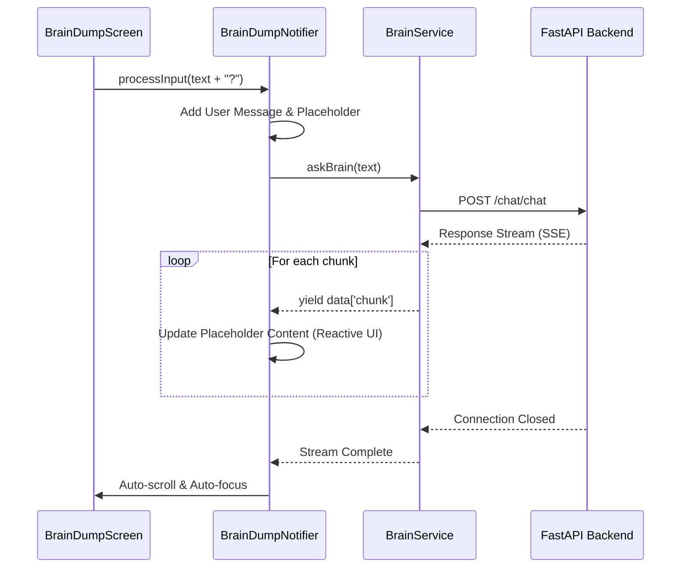
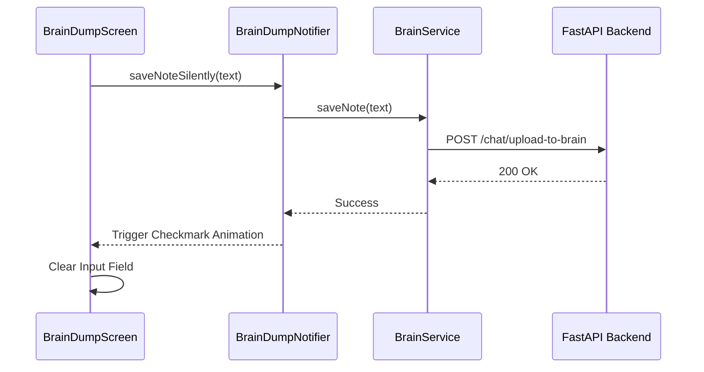
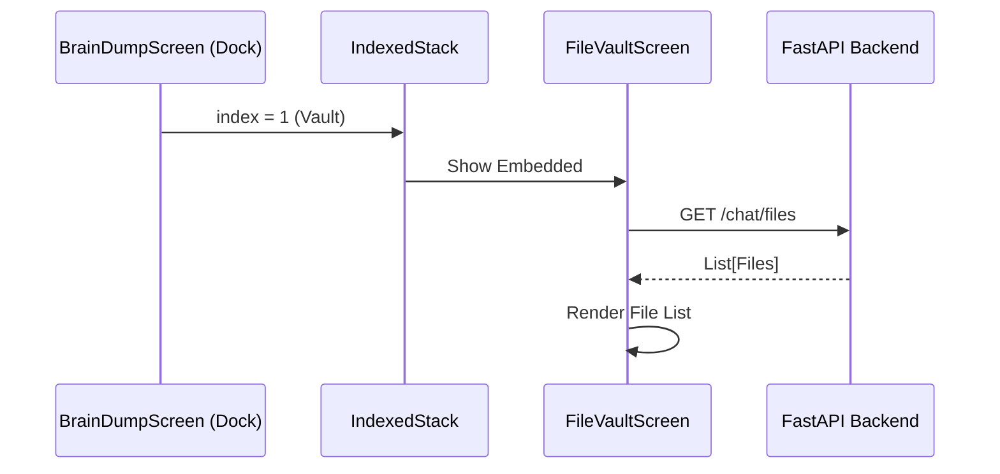

--
# Brain Dump Frontend Documentation

## 1. Architecture Overview
The frontend is built with **Flutter**, utilizing a feature-first folder structure and **Riverpod** for robust state management. It follows a **"Black Canvas"** minimalist design philosophy—pure black background, terminal-style text output, and zero-distraction interfaces.

### Tech Stack
- **Framework**: Flutter (Dart)
- **State Management**: Flutter Riverpod (Providers, StateNotifiers, AsyncValue)
- **Networking**: Dio (with SSE support for streaming responses)
- **Local Storage**: Flutter Secure Storage (for JWT persistence)
- **UI Components**: Minimalist typography, Glassmorphism Dock, and custom animations (e.g., Checkmark feedback).

### Folder Structure
```text
lib/
├── core/
│   ├── constants/        # API endpoints and Timeouts
│   ├── providers/        # Global singletons (e.g., dio_provider)
│   └── theme/            # Minimalist color palette constants
├── features/
│   ├── auth/             # Authentication logic & UI
│   ├── brain_dump/       # Core Chat / Note entry logic
│   │   ├── models/       # ChatMessage entities
│   │   ├── providers/    # BrainDumpNotifier (Streaming logic)
│   │   ├── services/     # BrainService (SSE client)
│   │   └── widgets/      # MinimalMessageRow, Input field
│   ├── dock/             # Glassmorphism Pill Dock
│   ├── vault/            # File Vault integration
│   └── onboarding/       # New user experience flow
└── screens/              # Top-level screen composites
    ├── brain_dump_screen.dart # Unified "Black Canvas" Home
    ├── dashboard_screen.dart  # Legacy/Alternative view
    └── neural_canvas_page.dart # Visualization view
```

---

## 2. Key Providers & Services

| Provider | Type | Responsibility |
| :--- | :--- | :--- |
| `authControllerProvider` | `StateNotifierProvider` | Handles Login/Signup, stores JWT, manages Auth state. |
| `brainServiceProvider` | `Provider` | API client for `/chat`, `/upload-to-brain`, and `/files`. |
| `brainDumpProvider` | `StateNotifierProvider` | Manages chat history, streaming state, and silent note saving. |
| `filesProvider` | `FutureProvider` | Fetches the list of files for the Vault view. |
| `dioProvider` | `Provider` | Configured Dio instance (BaseUrl, Timeouts). |

---

## 3. Interaction Flows (Sequence Diagrams)

### Flow A: Streaming Chat (ASK AI)
How the app handles asynchronous Server-Sent Events (SSE).



### Flow B: Silent Note Saving
Quick capture without cluttered chat history.



### Flow C: Integrated Vault View
Embedded file management within the main screen.



---

## 4. State Management Strategy

The app uses **Riverpod StateNotifiers** to manage complex flows like streaming:

1.  **Input Categorization**: The `BrainDumpScreen` determines if input is a **Query** (ends in "?") or a **Note** (standard text).
2.  **Streaming Updates**: `BrainDumpNotifier` listens to the `BrainService` stream and updates the message list in real-time by mapping IDs and appending content.
3.  **Cleanup Logic**: When saved as a note, logic handles fading out temporary status messages ("Memorizing...") to keep the "Black Canvas" clean.
4.  **Error Handling**: Dio interceptors and SSE try-catch blocks capture network issues, piping errors back to the UI via the `error` field in `BrainDumpState`.


# --- FEATURE INTEGRATIONS (FRONTEND) ---

The Frontend is separated logically into a feature-driven architecture within `lib/features`. Screen composites live in `lib/screens`, combining these feature widgets.

## 5. Active Features Overview

### 5.1 Analytics (`lib/features/analytics`)
Responsible for processing the backend `BrainAnalytics` metrics and displaying them in the **Insights Dashboard**.
- **Widgets**: `ThemeChart`, `SentimentGraph`, `ActionRatioWidget`, `ConsistencyStreakWidget`.
- **Services**: Connects to the `/analytics/*` endpoints.

### 5.2 Vault (`lib/features/vault`)
Handles local viewing of the RAG vectors' source materials (PDFs, Markdown, text).
- **Widgets**: Includes secure document viewers with built-in token authorization to prevent direct file access without authentication.

### 5.3 Dock (`lib/features/dock`)
The main navigation cluster for the application, designed as a minimalist floating Glassmorphism "pill" at the bottom of the screen. Controls switching between Chat, Dashboard, and Vault modes.

### 5.4 Music Context (`lib/features/music`)
Integrates with the Spotify API to append ongoing tracking context to notes saved in the system.
- **Providers**: `spotify_auth_provider`, `recent_tracks_provider`.

### 5.5 Onboarding & Auth (`lib/features/auth` & `lib/features/onboarding`)
A specialized flow handling JWT acquisition and storage in the Secure Storage.

---

## 6. Primary Screens (`lib/screens/`)

1. **`brain_dump_screen.dart`**: The main anchor. Contains the `IndexedStack` that houses the main Chat/Note interface, the Vault, and the Insights dashboard, easily switchable via the `Dock`.
2. **`dashboard_screen.dart`**: Renders the complete Insights experience using components purely from `lib/features/analytics`.
3. **`neural_canvas_page.dart`**: Used to map thought patterns into visual graphs using force-directed graphs to represent connection clusters.

---

## 7. The Subconscious Experience (UI)

The UI utilizes specific mechanics to reinforce the "Internal Monologue" feel.

- **Typing Animation Layer**: Responses are purposely delayed with a "..." spinner, and output is typed character-by-character based on a `Timer` array to mimic a human-like delay.
- **Context Indicators**: Small visual badges (Chips) will appear beneath thoughts to show if `Music` or `Location` metadata influenced the response.

