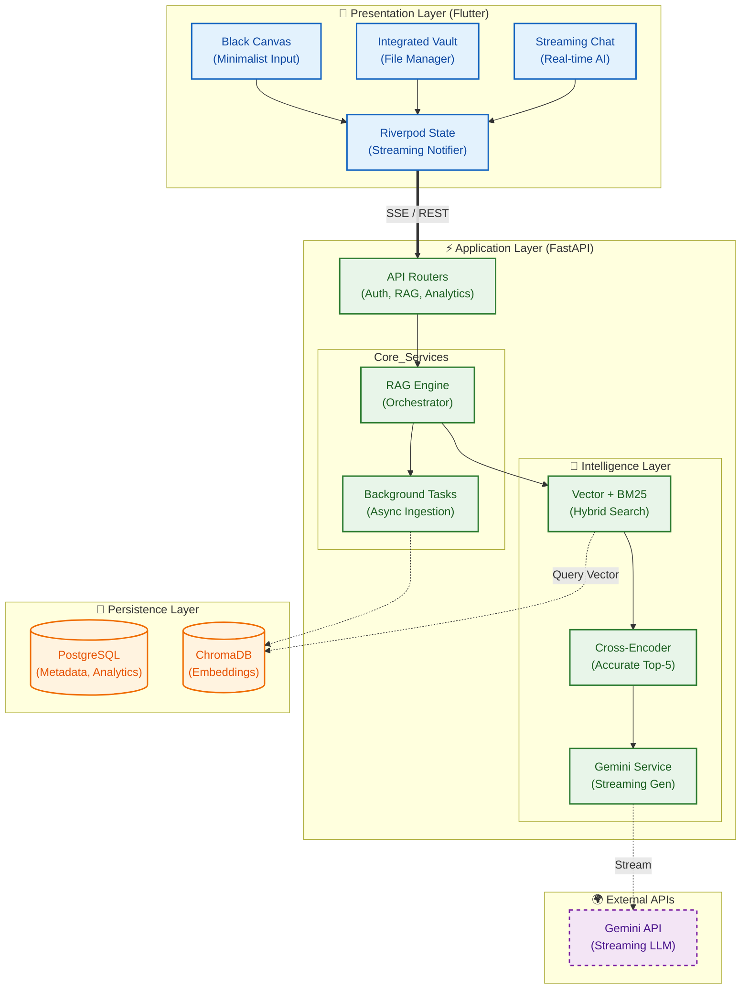

---
**Tags:** #flutter #riverpod #architecture #backend #fastapi #braindump #RAG #SSE #minimialism
**Updated:** 2026-03-01
---

# 🧠 Project: Brain Dump (Context-Aware Knowledge Graph)

## 1. Abstract
"Brain Dump" is a minimalist, mobile-first application designed to solve the "Fragmented Attention" problem. The system utilizes a **Client-Server Architecture** with a modular **FastAPI** backend and a feature-first **Flutter** frontend. It features a sophisticated **Two-Stage RAG Pipeline** (Retrieval-Augmented Generation) with **Contextual Re-ranking** and **Streaming Responses** to provide near-instant, highly accurate cognitive assistance.

---

## 2. High-Level System Architecture
The system follows a modern **Three-Tier Architecture** upgraded for AI workloads:
1.  **Presentation Layer (Client):** Minimalist Flutter App handling caching, markdown rendering, and local streaming.
2.  **Application Layer (Server):** Modular FastAPI backend handling streaming (SSE), asynchronous RAG ingestion, and analytics orchestration.
3.  **Data Layer (Persistence):** PostgreSQL (metadata, histories) & ChromaDB Vector Store (`BAAI/bge-base-en-v1.5` embeddings) for semantic search.

### 🏛️ Master System Diagram



---

## 3. Component Breakdown

### A. The Client (Flutter `lib/features/`)
- **Philosophy:** The "Black Canvas." A distraction-free surface for immediate thought capture.
- **Architecture:** Feature-first modular design (`feature_name/screens`, `feature_name/services`, `feature_name/providers`).
- **Core Features:**
    - **Streaming UI:** Uses `StreamBuilder` and `StateNotifier` to render AI responses chunk-by-chunk.
    - **Analytical Dashboard:** Synchronizes with backend `/analytics` endpoints to visualize cognitive loops and themes.
    - **Integrated Vault:** Embedded UI handling PDFs and markdown rendering seamlessly.

### B. The Server (FastAPI `backend/app/`)
- **Structure:** Modularized into `routers/` (controllers), `services/` (business logic), and `models/` (DB definitions).
- **Core Advantages:** High-concurrency async processing, separated thread pools (`ThreadPoolExecutor`) for heavy AI models, preventing event-loop blocking.
- **Gemini Singleton:** A centralized singleton service guarding system prompts, stripping prompt injection attempts, and handling SSE generator states safely.

### C. The Intelligence Pipeline (RAG)
1. **Stage 1 (Hybrid Retrieval):** Fuses BM25 (sparse keyword match) and Dense Vector search (`bge-base-en-v1.5`) via Reciprocal Rank Fusion (RRF).
2. **Context Layers:** Injects Temporal context, location heuristics, emotional tone, and associative memories.
3. **Stage 2 (Re-ranking):** Precise scoring via `ms-marco-MiniLM-L-6-v2` cross-encoder.
4. **Generation:** Streams response directly to frontend via SSE.

---

## 4. Current File Structure Map

```text
brain-dump/
├── backend/app/
│   ├── api/routers/        # Modular API (auth.py, rag.py, analytics.py)
│   ├── core/               # Setup (database config, rate limiter config)
│   ├── models/             # SQLAlchemy schemas (models.py)
│   ├── schemas/            # Pydantic validation (schemas.py)
│   └── services/           # Business logic (rag_engine.py, gemini_service.py)
│
└── frontend/lib/
    ├── core/               # Shared constants, theme, utility widgets
    ├── features/           # Modularized feature domains
    │   ├── analytics/      # Dashboard and charts
    │   ├── auth/           # Login/Registration
    │   ├── brain_dump/     # Core streaming & note capture
    │   ├── dock/           # Bottom navigation pill
    │   └── vault/          # Document management
    └── screens/            # Top-level coordinator pages
```

---

## 5. API Flow: The Streaming Query
> _Goal: Interaction Start < 500ms_
1. **User** types a question (e.g., "What did I note about Python?").
2. **Flutter (`BrainService`)** opens an SSE connection to `/chat/chat`.
3. **FastAPI (`routers/rag.py`)** persists message and delegates to `rag_engine`.
4. **RAG Engine** executes BM25 + Vector search, runs RRF fusion, and hydrates context.
5. **GeminiService** wraps query in secure XML tags and requests LLM generation.
6. **FastAPI** `yields` JSON chunks immediately back over the SSE connection.
7. **Flutter** updates UI in real-time.

---

## 6. Official Documentation References
- **Backend Infrastructure & API:** `documentation/backend/BACKEND.md`
- **Frontend Architecture:** `documentation/frontedn/FRONTEND.md`
- **Deep RAG Analytics & Systems:** `documentation/backend/rag/RAG_SYSTEM.md`
