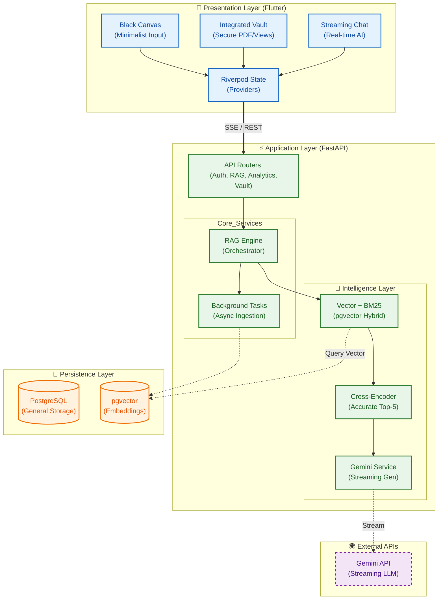

---
**Tags:** #flutter #riverpod #architecture #backend #fastapi #braindump #RAG #SSE #minimialism
**Updated:** 2026-03-01
---

# 🧠 Project: Brain Dump (Context-Aware Knowledge Graph)

## 1. Abstract
"Brain Dump" is a minimalist, mobile-first application designed to solve the "Fragmented Attention" problem. The system utilizes a **Client-Server Architecture** with a modular **FastAPI** backend and a feature-first **Flutter** frontend. It features a sophisticated **Two-Stage RAG Pipeline** (Retrieval-Augmented Generation) with **Contextual Re-ranking** and **Streaming Responses** to provide near-instant, highly accurate cognitive assistance.

---

## 2. High-Level System Architecture
The system follows a modern **Three-Tier Architecture** upgraded for AI workloads:
1.  **Presentation Layer (Client):** Minimalist Flutter App handling state (Riverpod), Markdown rendering, and SSE streaming.
2.  **Application Layer (Server):** Modular FastAPI backend handling Auth, background RAG ingestion, and analytics orchestration.
3.  **Data Layer (Persistence):** PostgreSQL (metadata, analytics) & pgvector database (`BAAI/bge-base-en-v1.5` embeddings) for semantic search.

### 🏛️ Master System Diagram



---

## 3. Component Breakdown

### A. The Client (Flutter `lib/features/`)
- **Philosophy:** The "Black Canvas." A distraction-free surface for immediate thought capture.
- **Architecture:** Organized strictly by feature (`lib/features/...`).
- **Core Active Features:**
    - **`brain_dump/`**: Core streaming Chat UI and transparent note capturing.
    - **`analytics/`**: Syncs with `/analytics` to visualize Dashboard loops, themes, and streaks.
    - **`vault/`**: Secure document management (view vectors, PDFs via syncfusion + token headers).
    - **`dock/`**: Main navigation cluster (Glassmorphism Pill).
    - **`music/`**: Spotify contextual data logic.
    - **`auth/` & `onboarding/`**: Core identity flow and JWT storage.

### B. The Server (FastAPI `backend/app/`)
- **Structure:** Modularized strictly by responsibility:
    - **`routers/`**: The endpoints (`auth.py`, `rag.py`, `analytics.py`, `files.py`, etc.).
    - **`services/`**: The abstracted logic (`rag_engine.py`, `gemini_service.py`).
    - **`models/` & `schemas/`**: Segregated DB models (SQLAlchemy) and Validation definitions (Pydantic).
- **Architecture Highlights:** Uses `ThreadPoolExecutor` to offload blocking tasks like Cross-Encoding and RRF logic, ensuring high-concurrency for the main FastAPI async loop.

### C. The Intelligence Pipeline (RAG Engine)
1. **Stage 1 (Hybrid Retrieval):** Fuses BM25 (sparse keyword) and Dense Vector search (Postgres L2 distance) via Reciprocal Rank Fusion (RRF).
2. **Context Layers:** Injects Temporal data, physical Location boundaries, emotional tone (via keyword analysis), and associative themes.
3. **Stage 2 (Re-ranking):** Precise semantic scoring via `ms-marco-MiniLM-L-6-v2` cross-encoder.
4. **Generation:** Securely streams via `GeminiService` directly back through the SSE pipeline.

---

## 4. Current File Structure Map

```text
brain-dump/
├── backend/app/
│   ├── api/routers/        # Modular API controllers
│   ├── core/               # Setup (database config, rate limiter config)
│   ├── models/             # SQLAlchemy schemas (models.py)
│   ├── schemas/            # Pydantic validation (schemas.py)
│   └── services/           # Business logic (rag_engine.py, gemini_service.py)
│
└── frontend/lib/
    ├── core/               # Shared constants, theme, utility widgets
    ├── features/           # Modularized feature domains
    │   ├── analytics/      # Dashboard and charts
    │   ├── auth/ & onboarding/ # Login/Registration
    │   ├── brain_dump/     # Core streaming & note capture
    │   ├── dock/           # Bottom navigation pill
    │   ├── music/          # Spotify contextual injection providers
    │   └── vault/          # Secure document management
    └── screens/            # Top-level coordinator pages (e.g. brain_dump_screen.dart)
```

---

## 5. Official Documentation References
To delve deeper into any isolated system, refer to the source documentation below:
- **Backend Documentation:** `documentation/backend/BACKEND.md`
- **Frontend Documentation:** `documentation/frontedn/FRONTEND.md`
- **RAG Architecture & Tuning:** `documentation/backend/rag/RAG_SYSTEM.md`
